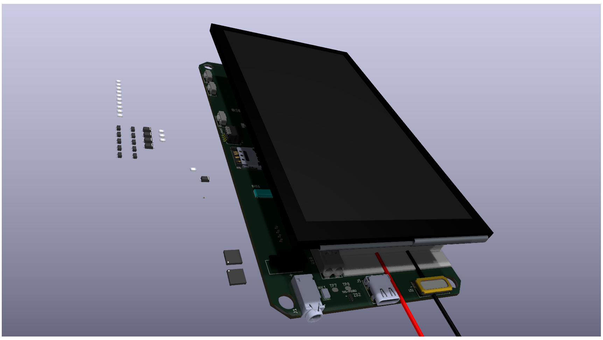
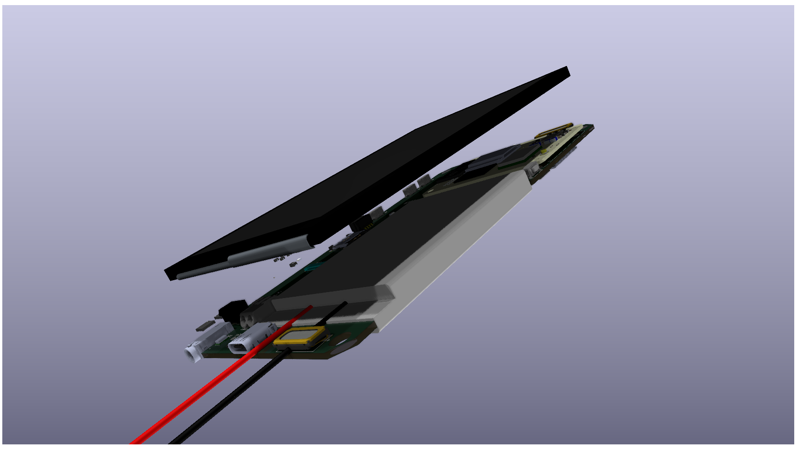
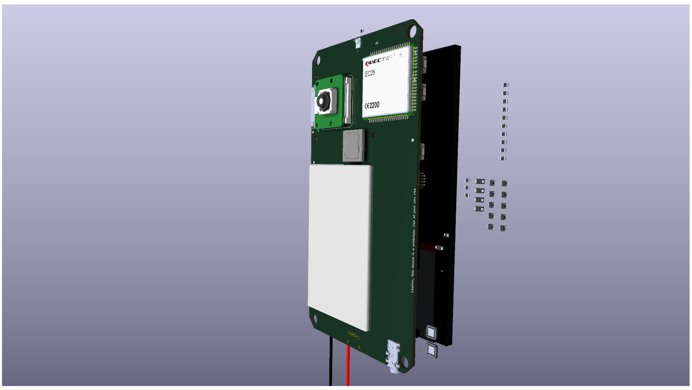
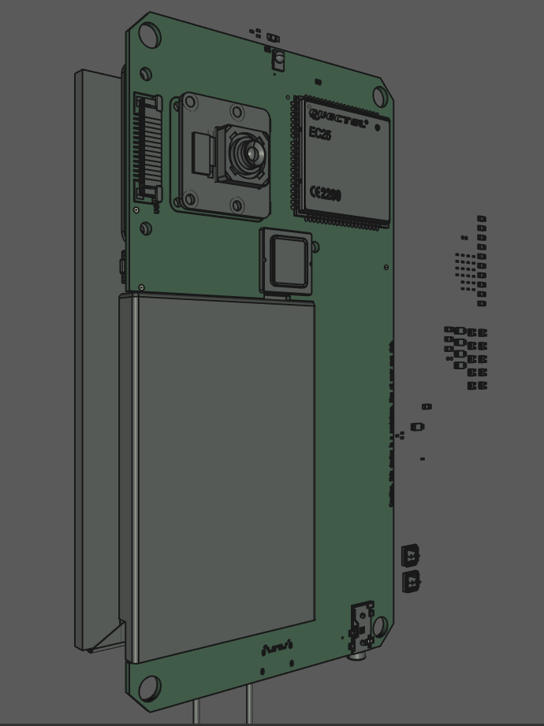
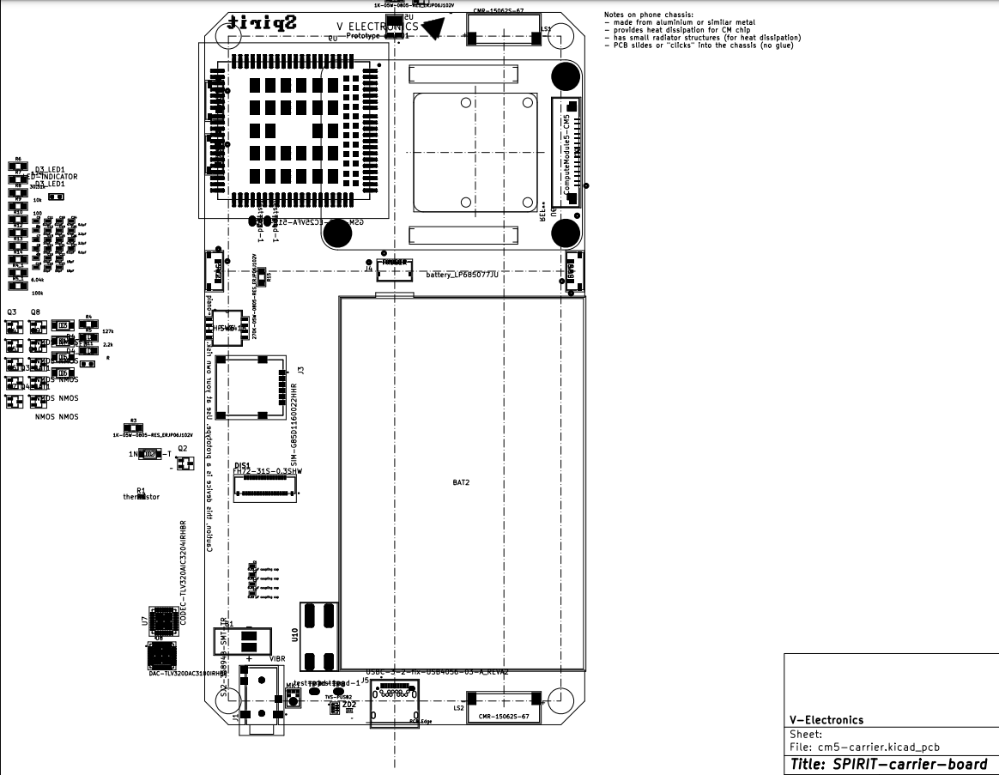
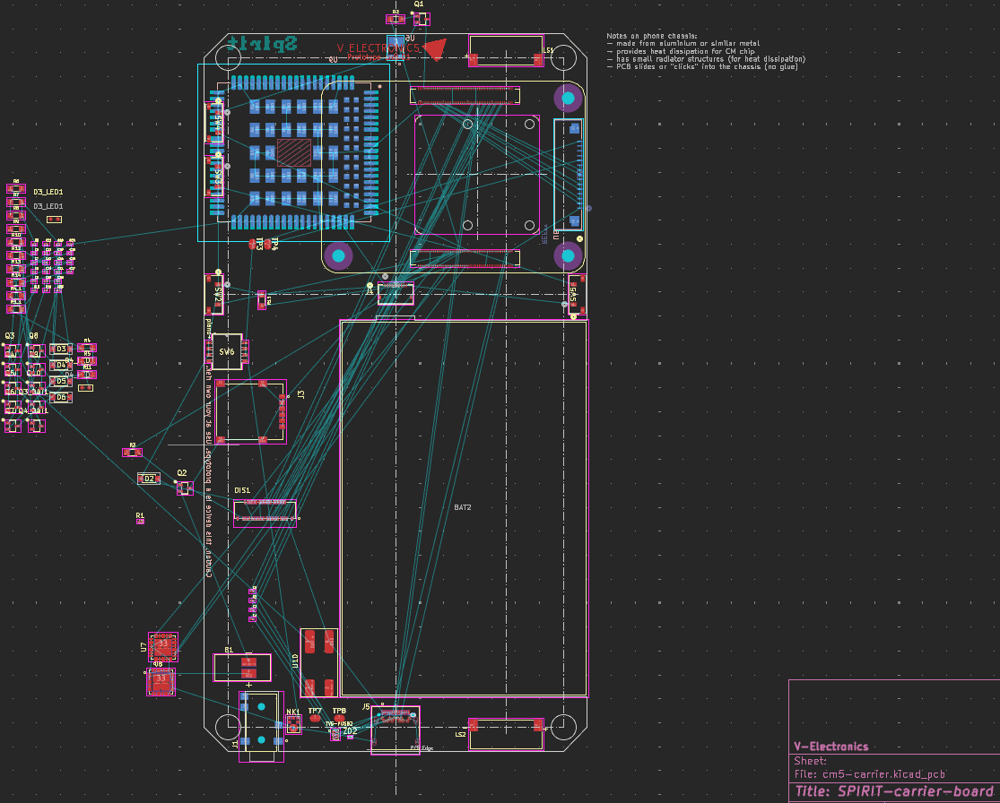

    
     
    

Open source smartphone, from available components. Prioritizing user experience, performance, control, repairability, innovation and privacy.
Contribution and feedback are very welcome! [Contribution Guide](https://github.com/V3lectronics/SPIRIT/blob/main/CONTRIBUTING.md).
(Currently in the development phase, progress documented here and on the V Electronics [YT channel](https://www.youtube.com/@V_Electronics)).

> [!WARNING]
> For imformation about the project please refer to the **SPIRIT [wiki](https://github.com/V3lectronics/SPIRIT/wiki)**, the contents below maybe outdated.
> Soon all information will be moved to the wiki!

# Quick links
1. **[Technical Specifications](https://github.com/V3lectronics/SPIRIT/wiki/Overview-technical-specs)**
2. **[Hardware And Electronics](https://github.com/V3lectronics/SPIRIT/wiki/Hardware-and-electronics)**
3. **[Software And Operating System](https://github.com/V3lectronics/SPIRIT/wiki/Operating-System)**
4. **[SPIRIT wiki](https://github.com/V3lectronics/SPIRIT/wiki)**
5. **[Community](https://github.com/V3lectronics/SPIRIT/wiki/Community)**
6. **[DIY Build Guide](https://github.com/barbarjan/SPIRIT#diy-build-guide)** _Coming soon!!!_
7. **[Parts List](https://github.com/barbarjan/SPIRIT#parts-list)** _Coming soon!!!_
8. **[Cost](https://github.com/barbarjan/SPIRIT#cost)** _Coming soon!!!_
9. **[Ethical And Environmental Concerns](https://github.com/barbarjan/SPIRIT#ethical-and-environmental-concerns)** _Coming soon!!!_
10. **[Compliance And Legality](https://github.com/barbarjan/SPIRIT#compliance-and-legality)** _Coming soon!!!_
11. **[Resources](https://github.com/barbarjan/SPIRIT#resources)**

# Progress

# Early screenshots
<small> (click to expand) </small>

<table>
  <tr>
    <td></td>
    <td></td>
    <td></td>
  </tr>
</table>

<table>
  <tr>
    <td></td>
    <td></td>
    <td></td>
  </tr>
</table>

# DIY Build Guide

Link to build guide/tutorial: COMING SOON!!!

# Parts List

_Coming soon!!!_

To get the most up-to-date parts list please look
at the BOM. Certain components such as the camera or the compute module can be swapped for a different
model - the presented setup is just a suggestion.

# Cost

_Coming soon!!!_

# Ethical And Environmental Concerns

SPIRIT phones avoid components produced in unfair or harmful ways, as well as
containing conflict minerals if possible.

The goal is to be 100% ethically and environmentally "clean" as soon as possible, however that is
a hard task and presents multiple enginnering challenges.

# Compliance And Legality

_Coming soon!!!_

# Resources
- [SPIRIT wiki](https://github.com/V3lectronics/SPIRIT/wiki)
- [Rpi CM5 datasheet](https://datasheets.raspberrypi.com/cm5/cm5-datasheet.pdf)
- [Rpi CM4 datasheet](https://datasheets.raspberrypi.com/cm4/cm4-datasheet.pdf)
- [Rpi CM5 and CM 4 useful interactive pinout](https://atctwo.net/projects/pinout/index.html)
